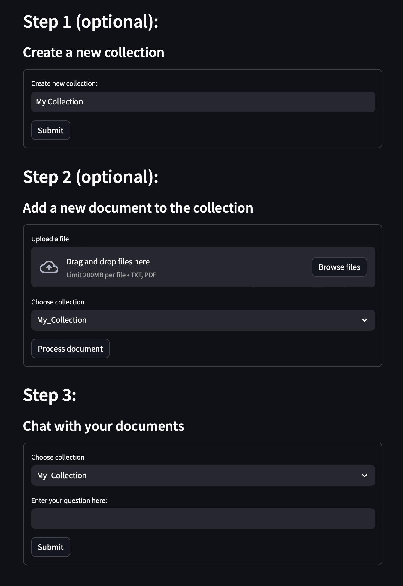

# doc-chat
A streamlit app that allows you to aks question of a document using gpt-4
## Installation
I highly recommend using a virtual enviroment to run this app. For this, install [Anaconda](https://www.anaconda.com/download) and run:
```bash
conda create -n doc-chat python=3.10
```
Once the virtual enviroment is set up run:
```bash
conda activate doc-chat
```
Once inside the virtual enviroment install required packages:
```bash
pip install -r requirements.txt
``````

create a `.env` file to hold you `OPENAI_API_KEY`

```bash
OPENAI_API_KEY="your-openai-api-key"
```
To run the app make sure you're inside the virtual enviroment and run:
```bash
streamlit run app.py
```
## Screenshot
